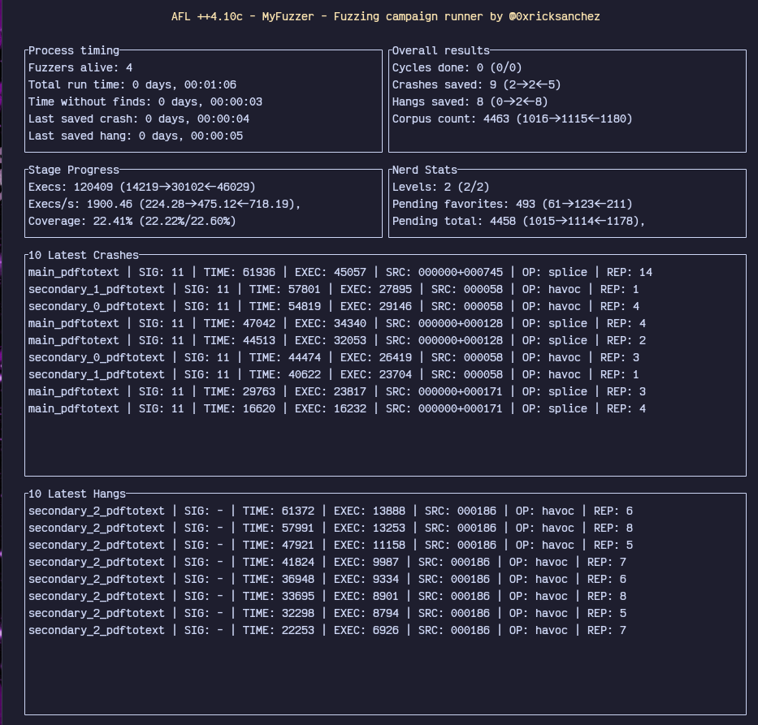

# AFL Runner

[](https://crates.io/crates/afl_runner)
[](LICENSE)

`AFL_Runner` is a modern CLI tool designed to streamline running efficient multi-core [AFLPlusPlus](https://github.com/AFLplusplus/AFLplusplus) campaigns. The default configuration is based on the section [_Using multiple cores_](https://aflplus.plus/docs/fuzzing_in_depth/#c-using-multiple-cores) of the official documentation.

## Getting Started 🚀

### Prerequisites

- [Rust toolchain](https://www.rust-lang.org/tools/install) 🦀
- [AFLPlusPlus](https://github.com/AFLplusplus/AFLplusplus)

### Installation

You can compile `AFL_Runner` yourself:

```bash
git clone https://github.com/0xricksanchez/AFL_Runner.git alfrunner
cd alfrunner
cargo build --release
./target/release/afl_runner --help
```

Or install via [crates.io](https://crates.io/crates/afl_runner):

```bash
cargo install afl_runner
afl_runner --help
```

## Features ✨

`AFL_Runner` allows you to set the most necessary AFLPlusplus flags and mimics the AFLplusplus syntax for these options:

- Supported AFLplusplus flags:

  - [x] Corpus directory
  - [x] Output directory
  - [x] Dictionary file
  - [x] Custom `afl-fuzz` binary path for all instances
  - [x] Supply arguments to target binary (including @@)
  - [x] Amount of runner commands to generate
  - [x] Support for \*SAN, CMPLOG, CMPCOV binaries

- Other features:
  - [x] Add Tmux option to automatically create an appropriate layout for all runners
  - [x] TUI
  - [x] Provide a configuration file via `--config` to make sharing/storing per project configurations easier
    - [x] Automatically read out a configuration named `aflr_cfg.toml` in the `CWD` when no `--config` was supplied

_Note_: Arguments supplied over the command-line take precedence over any configuration file options.

## Roadmap 🗺️

- [ ] Add remote option 🌐
- [ ] Integrate [statsd](https://registry.hub.docker.com/r/prom/statsd-exporter)
- [ ] Add more sensible defaults for other options
- [ ] Add more configuration options
- [ ] Allow AFLPlusPlus forks to be used on some amount of runners

## Usage Example 💡

Here's an example of generating AFL++ commands with `AFL_Runner`:

```bash
afl_runner -t /tmp/test_bins/target -s /tmp/test_bins/target_asan -c /tmp/test_bins/target_cmplog -l /tmp/test_bins/target_cmpcov -n 16 -i /tmp/seed_corpus -o /tmp/afl_out -x /tmp/fuzzing.dict -m "custom_fuzz_session"
 --dry-run -- 'arg1 arg2 --arg3 --arg4 @@'
Generated commands:
    0. AFL_AUTORESUME=1 AFL_FINAL_SYNC=0 AFL_DISABLE_TRIM=0 AFL_KEEP_TIMEOUTS=1 AFL_EXPAND_HAVOC_NOW=1 AFL_IGNORE_SEED_PROBLEMS=0 AFL_IMPORT_FIRST=0 AFL_TESTCACHE_SIZE=250  /usr/local/bin/afl-fuzz -P explore -a text -p fast -i /tmp/seed
_corpus -o /tmp/afl_out -M main_target -x /tmp/fuzzing.dict -- /tmp/test_bins/target_asan arg1 arg2 --arg3 --arg4 @@
    1. AFL_AUTORESUME=1 AFL_FINAL_SYNC=0 AFL_DISABLE_TRIM=1 AFL_KEEP_TIMEOUTS=0 AFL_EXPAND_HAVOC_NOW=0 AFL_IGNORE_SEED_PROBLEMS=0 AFL_IMPORT_FIRST=0 AFL_TESTCACHE_SIZE=250  /usr/local/bin/afl-fuzz -P exploit -p explore -i /tmp/seed_corp
us -o /tmp/afl_out -S slave_0_target -x /tmp/fuzzing.dict -c /tmp/test_bins/target_cmplog -- /tmp/test_bins/target arg1 arg2 --arg3 --arg4 @@
    2. AFL_AUTORESUME=1 AFL_FINAL_SYNC=0 AFL_DISABLE_TRIM=1 AFL_KEEP_TIMEOUTS=1 AFL_EXPAND_HAVOC_NOW=0 AFL_IGNORE_SEED_PROBLEMS=0 AFL_IMPORT_FIRST=0 AFL_TESTCACHE_SIZE=250  /usr/local/bin/afl-fuzz -p coe -i /tmp/seed_corpus -o /tmp/afl_
out -S slave_1_target -x /tmp/fuzzing.dict -c /tmp/test_bins/target_cmplog -- /tmp/test_bins/target arg1 arg2 --arg3 --arg4 @@
    3. AFL_AUTORESUME=1 AFL_FINAL_SYNC=0 AFL_DISABLE_TRIM=0 AFL_KEEP_TIMEOUTS=1 AFL_EXPAND_HAVOC_NOW=0 AFL_IGNORE_SEED_PROBLEMS=0 AFL_IMPORT_FIRST=0 AFL_TESTCACHE_SIZE=250  /usr/local/bin/afl-fuzz -P explore -a text -p lin -i /tmp/seed_
corpus -o /tmp/afl_out -S slave_2_target -x /tmp/fuzzing.dict -l 2  -c /tmp/test_bins/target_cmplog -- /tmp/test_bins/target arg1 arg2 --arg3 --arg4 @@
    4. AFL_AUTORESUME=1 AFL_FINAL_SYNC=0 AFL_DISABLE_TRIM=1 AFL_KEEP_TIMEOUTS=0 AFL_EXPAND_HAVOC_NOW=0 AFL_IGNORE_SEED_PROBLEMS=0 AFL_IMPORT_FIRST=0 AFL_TESTCACHE_SIZE=250  /usr/local/bin/afl-fuzz -P exploit -p quad -i /tmp/seed_corpus
-o /tmp/afl_out -S slave_3_target -x /tmp/fuzzing.dict -l 2  -c /tmp/test_bins/target_cmplog -- /tmp/test_bins/target arg1 arg2 --arg3 --arg4 @@
    5. AFL_AUTORESUME=1 AFL_FINAL_SYNC=0 AFL_DISABLE_TRIM=1 AFL_KEEP_TIMEOUTS=1 AFL_EXPAND_HAVOC_NOW=0 AFL_IGNORE_SEED_PROBLEMS=0 AFL_IMPORT_FIRST=0 AFL_TESTCACHE_SIZE=250  /usr/local/bin/afl-fuzz -a text -Z -p exploit -i /tmp/seed_corp
us -o /tmp/afl_out -S slave_4_target -x /tmp/fuzzing.dict -- /tmp/test_bins/target_cmpcov arg1 arg2 --arg3 --arg4 @@
    6. AFL_AUTORESUME=1 AFL_FINAL_SYNC=0 AFL_DISABLE_TRIM=0 AFL_KEEP_TIMEOUTS=1 AFL_EXPAND_HAVOC_NOW=1 AFL_IGNORE_SEED_PROBLEMS=0 AFL_IMPORT_FIRST=0 AFL_TESTCACHE_SIZE=250  /usr/local/bin/afl-fuzz -a binary -Z -p rare -i /tmp/seed_corpu
s -o /tmp/afl_out -S slave_5_target -x /tmp/fuzzing.dict -- /tmp/test_bins/target arg1 arg2 --arg3 --arg4 @@
    7. AFL_AUTORESUME=1 AFL_FINAL_SYNC=0 AFL_DISABLE_TRIM=0 AFL_KEEP_TIMEOUTS=1 AFL_EXPAND_HAVOC_NOW=1 AFL_IGNORE_SEED_PROBLEMS=0 AFL_IMPORT_FIRST=0 AFL_TESTCACHE_SIZE=250  /usr/local/bin/afl-fuzz -P explore -L 0 -p fast -i /tmp/seed_co
rpus -o /tmp/afl_out -S slave_6_target -x /tmp/fuzzing.dict -- /tmp/test_bins/target arg1 arg2 --arg3 --arg4 @@
    8. AFL_AUTORESUME=1 AFL_FINAL_SYNC=0 AFL_DISABLE_TRIM=1 AFL_KEEP_TIMEOUTS=0 AFL_EXPAND_HAVOC_NOW=0 AFL_IGNORE_SEED_PROBLEMS=0 AFL_IMPORT_FIRST=0 AFL_TESTCACHE_SIZE=250  /usr/local/bin/afl-fuzz -a binary -p explore -i /tmp/seed_corpu
s -o /tmp/afl_out -S slave_7_target -x /tmp/fuzzing.dict -- /tmp/test_bins/target_cmpcov arg1 arg2 --arg3 --arg4 @@
    9. AFL_AUTORESUME=1 AFL_FINAL_SYNC=0 AFL_DISABLE_TRIM=0 AFL_KEEP_TIMEOUTS=1 AFL_EXPAND_HAVOC_NOW=1 AFL_IGNORE_SEED_PROBLEMS=0 AFL_IMPORT_FIRST=0 AFL_TESTCACHE_SIZE=250  /usr/local/bin/afl-fuzz -a binary -p coe -i /tmp/seed_corpus -o
 /tmp/afl_out -S slave_8_target -x /tmp/fuzzing.dict -- /tmp/test_bins/target arg1 arg2 --arg3 --arg4 @@
   10. AFL_AUTORESUME=1 AFL_FINAL_SYNC=0 AFL_DISABLE_TRIM=1 AFL_KEEP_TIMEOUTS=1 AFL_EXPAND_HAVOC_NOW=1 AFL_IGNORE_SEED_PROBLEMS=0 AFL_IMPORT_FIRST=0 AFL_TESTCACHE_SIZE=250  /usr/local/bin/afl-fuzz -P explore -Z -p lin -i /tmp/seed_corpu
s -o /tmp/afl_out -S slave_9_target -x /tmp/fuzzing.dict -- /tmp/test_bins/target arg1 arg2 --arg3 --arg4 @@
   11. AFL_AUTORESUME=1 AFL_FINAL_SYNC=0 AFL_DISABLE_TRIM=1 AFL_KEEP_TIMEOUTS=0 AFL_EXPAND_HAVOC_NOW=1 AFL_IGNORE_SEED_PROBLEMS=0 AFL_IMPORT_FIRST=0 AFL_TESTCACHE_SIZE=250  /usr/local/bin/afl-fuzz -P explore -a text -p quad -i /tmp/seed
_corpus -o /tmp/afl_out -S slave_10_target -x /tmp/fuzzing.dict -- /tmp/test_bins/target arg1 arg2 --arg3 --arg4 @@
   12. AFL_AUTORESUME=1 AFL_FINAL_SYNC=0 AFL_DISABLE_TRIM=0 AFL_KEEP_TIMEOUTS=0 AFL_EXPAND_HAVOC_NOW=0 AFL_IGNORE_SEED_PROBLEMS=0 AFL_IMPORT_FIRST=0 AFL_TESTCACHE_SIZE=250  /usr/local/bin/afl-fuzz -p exploit -i /tmp/seed_corpus -o /tmp/
afl_out -S slave_11_target -x /tmp/fuzzing.dict -- /tmp/test_bins/target_cmpcov arg1 arg2 --arg3 --arg4 @@
   13. AFL_AUTORESUME=1 AFL_FINAL_SYNC=0 AFL_DISABLE_TRIM=1 AFL_KEEP_TIMEOUTS=0 AFL_EXPAND_HAVOC_NOW=0 AFL_IGNORE_SEED_PROBLEMS=0 AFL_IMPORT_FIRST=0 AFL_TESTCACHE_SIZE=250  /usr/local/bin/afl-fuzz -p rare -i /tmp/seed_corpus -o /tmp/afl
_out -S slave_12_target -x /tmp/fuzzing.dict -- /tmp/test_bins/target arg1 arg2 --arg3 --arg4 @@
   14. AFL_AUTORESUME=1 AFL_FINAL_SYNC=0 AFL_DISABLE_TRIM=1 AFL_KEEP_TIMEOUTS=0 AFL_EXPAND_HAVOC_NOW=0 AFL_IGNORE_SEED_PROBLEMS=0 AFL_IMPORT_FIRST=0 AFL_TESTCACHE_SIZE=250  /usr/local/bin/afl-fuzz -P explore -p fast -i /tmp/seed_corpus
-o /tmp/afl_out -S slave_13_target -x /tmp/fuzzing.dict -- /tmp/test_bins/target arg1 arg2 --arg3 --arg4 @@
   15. AFL_AUTORESUME=1 AFL_FINAL_SYNC=1 AFL_DISABLE_TRIM=1 AFL_KEEP_TIMEOUTS=0 AFL_EXPAND_HAVOC_NOW=0 AFL_IGNORE_SEED_PROBLEMS=0 AFL_IMPORT_FIRST=0 AFL_TESTCACHE_SIZE=250  /usr/local/bin/afl-fuzz -P exploit -a binary -p explore -i /tmp
/seed_corpus -o /tmp/afl_out -S slave_14_target -x /tmp/fuzzing.dict -- /tmp/test_bins/target arg1 arg2 --arg3 --arg4 @@
```

_Note_: Supplying the \*SAN, CMPLOG, or CMPCOV binaries are optional and if omitted all invocations just contain the instrumented target instead.

## Showcase 🎥

`AFL_Runner` also includes a terminal user interface (TUI) for monitoring the fuzzing campaign progress:



## Contributing 🤝

Contributions are welcome! Please feel free to submit a pull request or open an issue for any bugs, feature requests, or improvements.

## License 📜

This project is licensed under the Apache License. See the [LICENSE](LICENSE) file for details.
